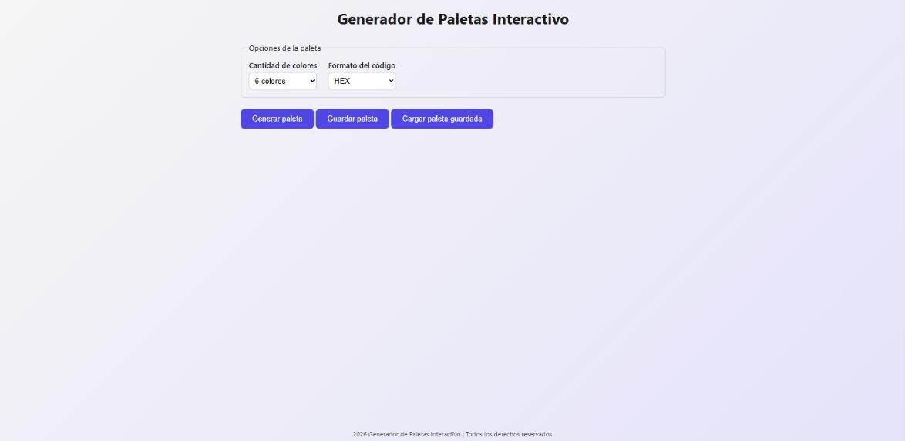
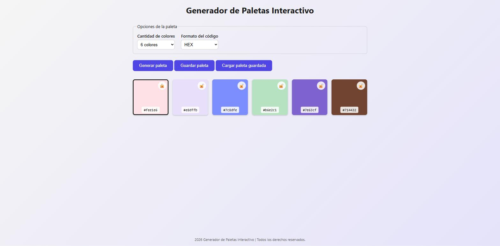
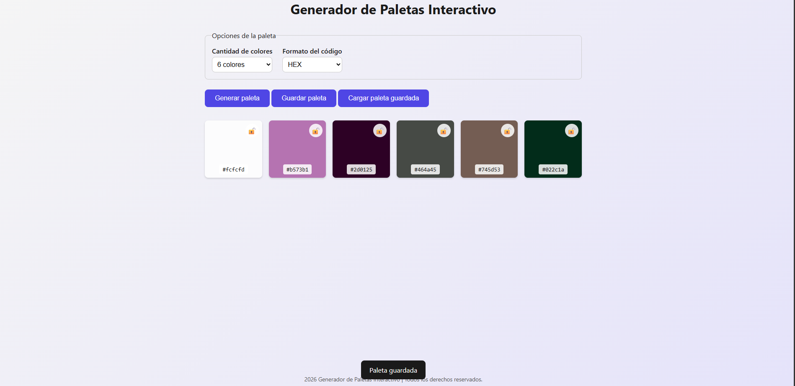

# Generador de Paletas Interactivo

Proyecto Integrador del Módulo 1 (HENRY). Aplicación web para generar paletas de colores aleatorias, hecha con HTML, CSS y JavaScript puro, sin frameworks.

Demo en vivo

https://tobiasjesus.github.io/ProyectoM1_TobiasAguilar/Desarrollo/index.html

Funcionalidades

- Elegir cantidad de colores (6, 8 o 9) y formato del código (HEX o HSL).
- Generar paleta aleatoria y ver el código de cada color.
- Bloquear colores para que no cambien al generar de nuevo.
- Copiar el código HEX haciendo click en una tarjeta.
- Guardar y cargar la última paleta (localStorage).

Decisiones técnicas

- Colores 100% aleatorios en HSL, sin restringir saturación/luminosidad, para que la paleta varíe de verdad en cada generación.
- El guardado en localStorage es de una sola paleta (la última), no una lista, para mantener el alcance simple.

Deploy (GitHub Pages)

El sitio vive en Desarrollo/, no en la raíz del repo. En Settings > Pages configuré "Deploy from a branch", rama main, carpeta / (root). Por eso la demo queda en la subruta /Desarrollo/index.html en vez de la raíz del dominio.

Capturas

Uso de IA

Usé Claude Code como tutor durante el desarrollo: cuando no entendia algo me explicaba el porque de eso y como podía encararlo, pero el código y las decisiones son mías. Registro de prompts en prompts-ia.md.
